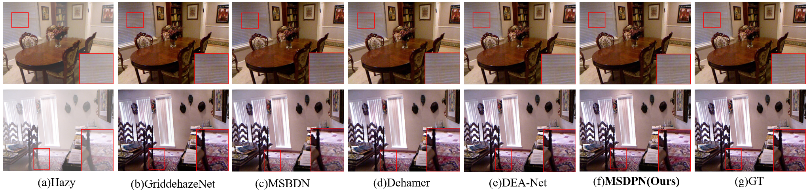
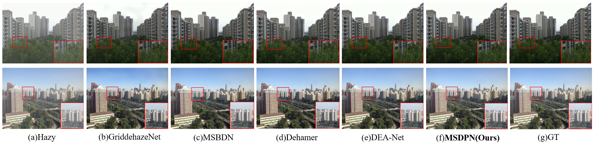
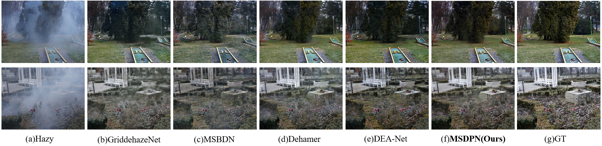
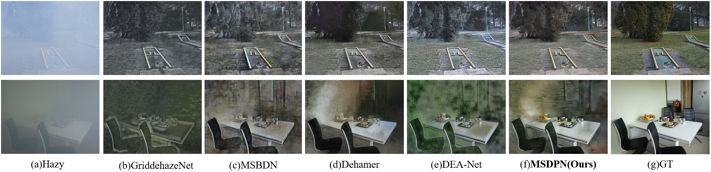
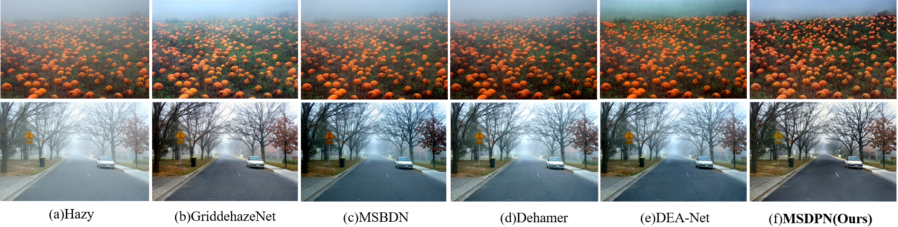

# MSDPN: Multi-Scale Network With Detail-Preserving For Image Dehazing

This is the official PyTorch implementation of MSDPN.  

 

## Abstract:

Image dehazing is a challenging task focused on restoring images degraded
by hazy weather conditions to their original clarity. Conventional dehazing models that preserve details are devoted to preserving high-frequency information in the frequency domain, such as using Fourier transform or wavelet transform. However, these methods usually require corresponding inverse transformations, which increase computational overhead. To build a lightweight network for image dehazing while preserving image details, we propose a multi-scale detail-preserving network (MSDPN). Specifically, we propose a simple and effective adaptive spectral refinement module (ASRM). This module utilizes a learnable low-pass filter to decompose the features into low-frequency and complementary high-frequency components dynamically and emphasizes useful frequency components utilizing channel-wise attention. Furthermore, to enhance the network's capability of capturing global haze information, we propose a global context-aware module (GCAM). GCAM obtains different types of context information through dilated convolution with different dilation rates and pooling downsampling. Moreover, we design an attention feature fusion module (AFFM) combining cross-channel attention and spatial attention to fuse the information flows obtained by the encoder-decoder. Extensive experimental results demonstrate the superior performance of the proposed model in both synthetic and real image dehazing, outperforming the SOTA algorithms.

## Environment:

- Windows: 10
- CUDA Version: 11.0 
- Python 3.8

## Dependencies:

- torch==1.13.1
- torchvision==0.14.1
- NVIDIA GPU and CUDA

## Qualitative Results

